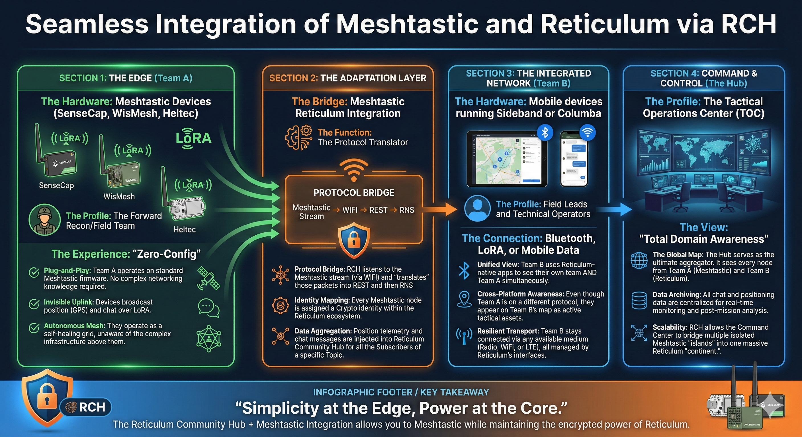

# Reticulum Meshtastic Integration

`Reticulum_Meshtastic_Integration` is a standalone Python 3.12 service that ingests Meshtastic packets over WiFi/TCP, maps Meshtastic nodes to RCH markers, and forwards broadcast chat into Reticulum Community Hub (RCH) topics.

## Scope

- In:
  - Meshtastic TCP/WiFi ingest (`host`, `port`, `channel`)
  - Position forwarding to RCH marker APIs
  - Broadcast chat forwarding to RCH topic/message APIs
  - Single RCH identity/API token
  - `start`, `stop`, `status` CLI
  - Stateless operation (in-memory node/topic cache only)
  - Auto-reconnect with exponential backoff
- Out:
  - Bluetooth/serial transports
  - Direct message bridging
  - Reticulum to Meshtastic reverse flow
  - Persistent telemetry/chat history
  - Rate limiting

## Use Case: Seamless Integration of Meshtastic and Reticulum via RCH


This bridge is designed for scenarios where a forward team uses off-the-shelf Meshtastic devices, while leadership/command uses Reticulum-native applications (and wants one shared operational picture).

### Section 1: The Edge (Team A)

- **Hardware**: Meshtastic devices (SenseCAP, WisMesh, Heltec, etc.)
- **Profile**: forward recon / field team
- **Experience**: "zero-config" Meshtastic

Team A runs standard Meshtastic firmware and operates as an autonomous LoRa mesh for position and broadcast chat. They don't need accounts, apps, or networking knowledge related to Reticulum or RCH.

- **Plug-and-Play**: Team A stays on stock Meshtastic firmware with familiar UX.
- **Invisible Uplink**: GPS and broadcast chat ride the LoRa mesh; the bridge picks them up over the device's TCP/WiFi interface.
- **Autonomous Mesh**: local comms remain self-healing even if the upstream link to RCH is intermittent.

### Section 2: The Adaptation Layer (this project)

- **Bridge**: `rch-mesh-bridge`
- **Function**: protocol translation and normalization

`rch-mesh-bridge` listens to the Meshtastic TCP API (typically exposed over WiFi) and converts what it receives into RCH REST calls:

- **Protocol bridge**: Meshtastic packets in, RCH REST calls out.
- **Identity mapping**: each marker has an `object_destination_hash` (the Reticulum-side identifier) that becomes the stable handle for that Meshtastic node in the RCH/Reticulum ecosystem.
- **Data aggregation**: position telemetry updates markers; channel broadcast chat is injected into an RCH topic (default `meshtastic.channel.{channel}`) for all subscribers.
- **Stable binding**: created markers are tagged in `notes` (default prefix `meshtastic_node_id=`) so the bridge can re-bind to existing markers across restarts.

At a glance:

| Meshtastic | RCH / Reticulum side |
|---|---|
| Node (`node_id`) | Marker (`object_destination_hash`) |
| Channel (`channel`) | Topic (`chat_topic_path`) |
| Position updates | Marker position updates |
| Broadcast chat | Topic messages |

Note: the bridge is intentionally one-way and stateless; any retention/archiving is handled by RCH, not by this service.

### Section 3: The Integrated Network (Team B)

- **Hardware**: mobile devices running Reticulum-native apps (e.g. Sideband, Columba)
- **Profile**: field leads and technical operators
- **Connection**: any available transport (Bluetooth, LoRa, WiFi, LTE)

Team B uses Reticulum-native tooling to see both their Reticulum peers and Team A's Meshtastic nodes in the same map/topic views via RCH. From their perspective, Team A appears as active tactical assets even though the underlying radio protocol is different.

- **Unified View**: Team B sees Team A + Team B together in one operational picture.
- **Cross-Platform Awareness**: Meshtastic-origin assets appear as first-class markers and chat participants.
- **Resilient Transport**: Reticulum-native apps can use whatever link is available (radio, WiFi, LTE) without changing Team A's workflow.

### Section 4: Command & Control (the Hub)

- **Hub**: Reticulum Community Hub (RCH)
- **Profile**: tactical operations center (TOC)
- **View**: "total domain awareness"

RCH becomes the aggregation point for markers and chat. Multiple `rch-mesh-bridge` instances can feed a single RCH (for example, one per Meshtastic "island"), scaling up to a shared Reticulum "continent" without changing Team A's field workflow.

- **The Global Map**: the TOC can monitor all Meshtastic and Reticulum assets in one place.
- **Data Archiving**: chat/marker history is centralized in RCH according to RCH's storage configuration (the bridge itself is stateless).
- **Scalability**: bridge multiple Meshtastic islands into one shared Reticulum-backed view by pointing them at the same RCH.

## Requirements

- Python `3.12+`
- A WiFi-capable LoRa device flashed with Meshtastic (Suggested: Heltec V3 or Heltec V4.)
- Network access to:
  - Meshtastic TCP endpoint (default `4403`)
  - RCH REST endpoint
- [Reticulum Community Hub (RCH)](https://github.com/FreeTAKTeam/Reticulum-Community-Hub) is required for this integration and must be running before the bridge starts.

## Install

```bash
python -m venv .venv
. .venv/bin/activate
pip install -e ".[dev]"
```

On Windows PowerShell:

```powershell
python -m venv .venv
.\.venv\Scripts\Activate.ps1
pip install -e ".[dev]"
```

## Configuration

Use `config.ini` and update required fields:

- `[meshtastic].host`
- `[rch].rest_url` (optional; defaults to `http://localhost:8000`)
- `[rch].auth_mode` (optional; default is unauthenticated `none`)
- `[rch].api_token` (required only for `bearer` or `x_api_key`)
- `[mapping].chat_topic_path` (optional; default `meshtastic.channel.{channel}`)

Chat topic behavior:

- On startup, the bridge loads RCH topics and verifies the configured chat topic path exists.
- If the topic is missing, the bridge logs an error and creates it automatically.
- Default created path format is `meshtastic.channel.{channel}` (for channel `0`, this is `meshtastic.channel.0`).

Runtime paths (`pid_file`, `status_file`) are resolved relative to the config file directory when not absolute.

### Meshtastic Device Role Guidance


- Recommended roles are `TRACKER` or `CLIENT`.
- Do **not** use any Meshtastic `TAK*` roles (including `TAK` and `TAK_TRACKER` / "TAK Tracker").
- `TRACKER` and `CLIENT` both work correctly for regular position flow payload ingestion.

## CLI

Important: start and verify RCH first, then start `rch-mesh-bridge`.

### Start (daemon mode by default)

```bash
rch-mesh-bridge start --config ./config.ini
```

### Start in foreground

```bash
rch-mesh-bridge start --foreground --config ./config.ini
```

### Stop

```bash
rch-mesh-bridge stop --config ./config.ini
```

### Status

```bash
rch-mesh-bridge status --json --config ./config.ini
```

Example:

```json
{
  "state": "running",
  "meshtastic_connected": true,
  "observed_nodes": 4,
  "last_packet": "2026-02-12T12:30:00Z"
}
```

## RCH REST Mapping

- Telemetry/object:
  - `POST /api/markers`
  - `PATCH /api/markers/{object_destination_hash}/position`
- Chat/topic:
  - `GET /Topic`
  - `POST /Topic`
  - `POST /Message`

## systemd

Example of a service for Linux:

```ini
[Unit]
Description=RCH Meshtastic Bridge
After=network-online.target
Wants=network-online.target

[Service]
Type=simple
User=meshbridge
Group=meshbridge
WorkingDirectory=/opt/rch-mesh-bridge
Environment=PYTHONUNBUFFERED=1
ExecStart=/opt/rch-mesh-bridge/.venv/bin/rch-mesh-bridge start --foreground --config /opt/rch-mesh-bridge/config.ini
Restart=always
RestartSec=5

[Install]
WantedBy=multi-user.target
```

Install and enable:

```bash
sudo cp /opt/rch-mesh-bridge/rch-mesh-bridge.service /etc/systemd/system/rch-mesh-bridge.service
sudo systemctl daemon-reload
sudo systemctl enable --now rch-mesh-bridge.service
sudo systemctl start rch-mesh-bridge.service
sudo systemctl status rch-mesh-bridge.service
```

View logs:

```bash
journalctl -u rch-mesh-bridge.service -f
```

## Development

Run tests:

```bash
pytest -q
```

## Troubleshooting

- `state=degraded`, `meshtastic_connected=false`
  - Check Meshtastic host/port reachability.
  - Confirm device exposes TCP API on the expected network.
- Marker creation fails
  - Validate RCH auth mode (`none`, `bearer`, `x_api_key`).
  - Verify token has access to `/api/markers`.
  - The bridge auto-retries marker creation with a supported symbol from `/api/markers/symbols` when RCH returns `422` for marker type/symbol.
  - Standard Meshtastic marker defaults to `map-marker-account`; if `marker_type` is `auto` (or left legacy `meshtastic_node`), the bridge sends marker type equal to the selected symbol.
- Chat not visible
  - Check topic permissions and `POST /Message` authorization.
  - Confirm `[mapping].chat_topic_path` resolves as expected.
  - On startup, check logs for "Configured topic path ... was not found in RCH. Creating topic now."
- Reconnect loop noisy
  - Increase `[runtime].reconnect_max_seconds`.
  - Set `[general].log_level = WARNING` for reduced logging.
- No/limited updates when the radio is set to a TAK role
  - Do not use any `TAK*` roles (`TAK`, `TAK_TRACKER`); use `TRACKER` or `CLIENT` instead.
